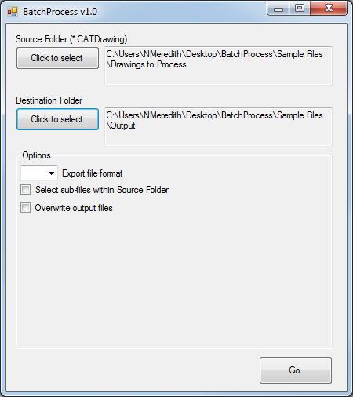

#BatchProcess#

##Version##
BatchProcess v1.0  
2014-11-03 by Neil Meredith <neil@sheetd.com>  

##Requirements##
Digital Project V1R5 or CATIA V5-6R2012 (aka R22) or higher

##Description##
BatchProcess is a CATIA/Digital Project tool that performs batch file operations on CATDrawings such as saving PDFs or DWG exports. As a framework, other sub-routines (such as updating text or content of CATDrawings) can be easily added on in the future.

##Usage##
- Open CATIA/Digital Project  
- Open BatchProcess application  
- Select a Source and Destination folder to your files (examples provided in "SampleFiles") 
- Run the program

##Notes##
Program currently only exports DWG files. Other Options settings have not been implemented yet.